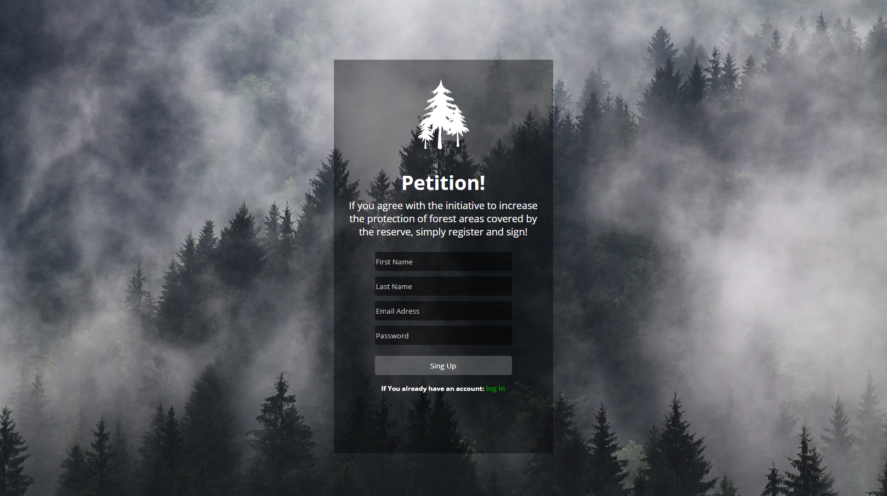
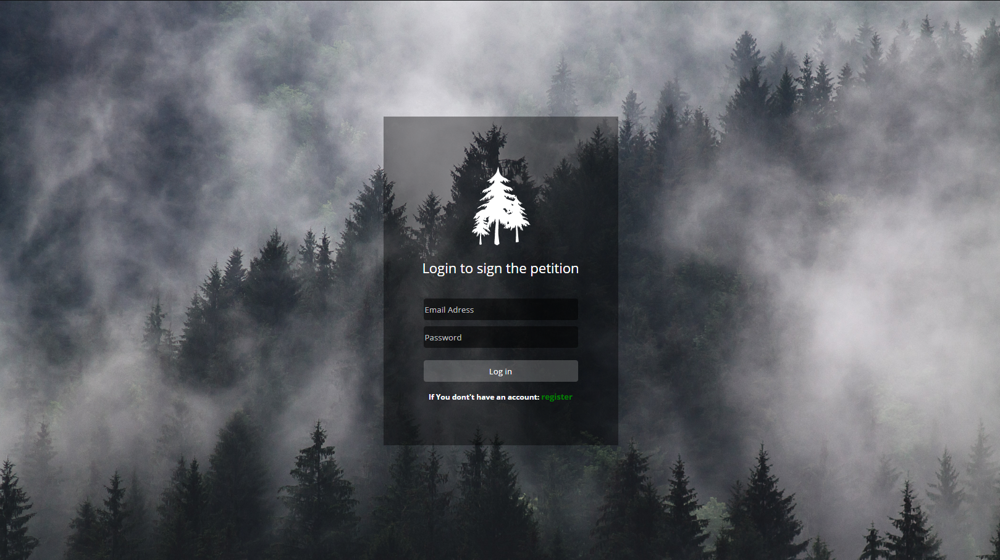
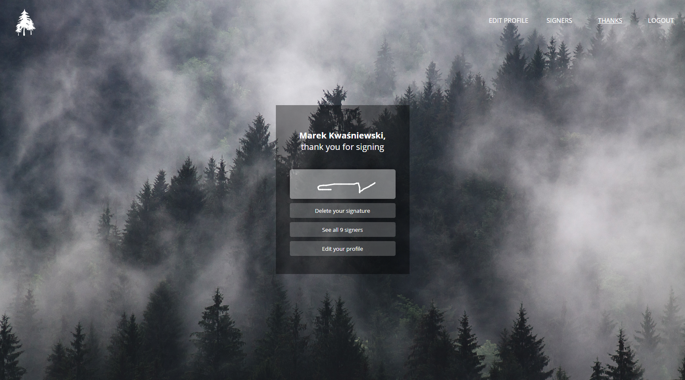
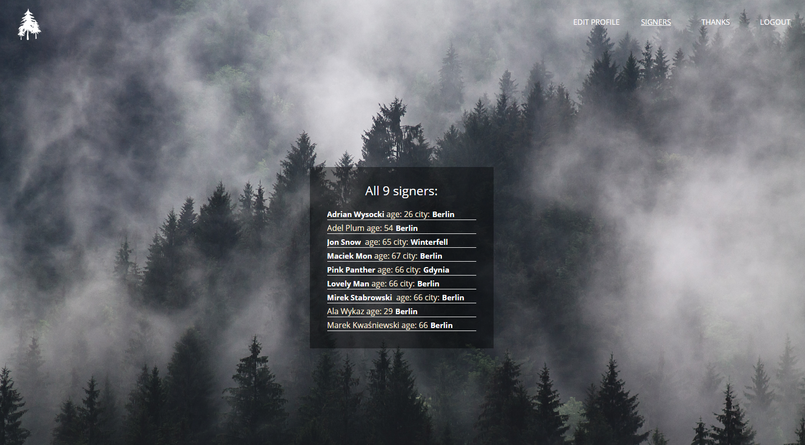
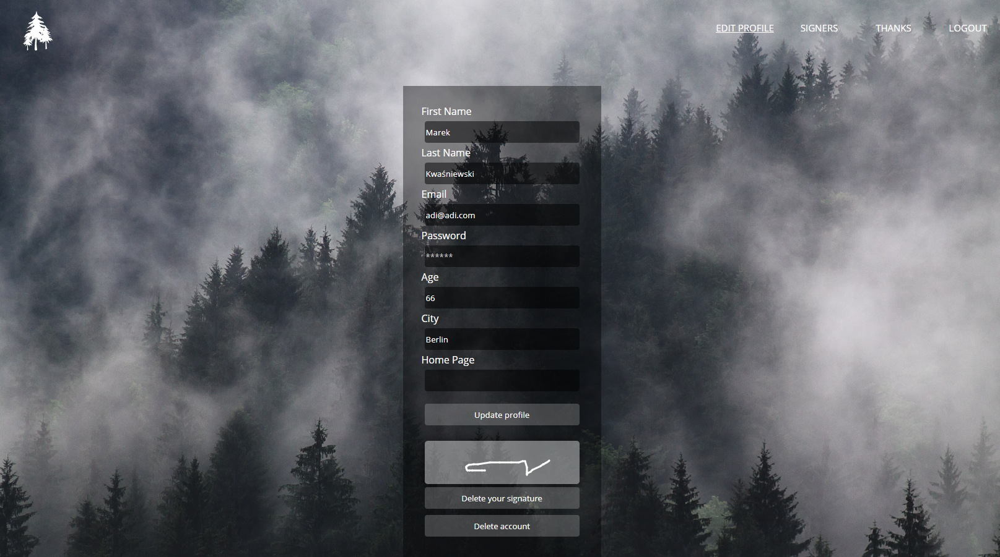
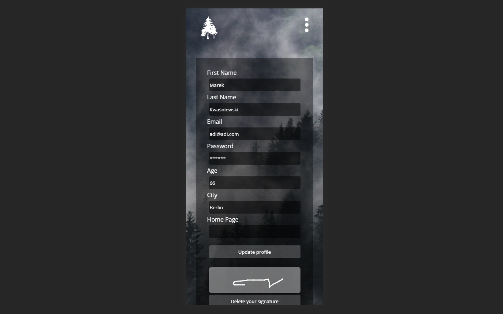
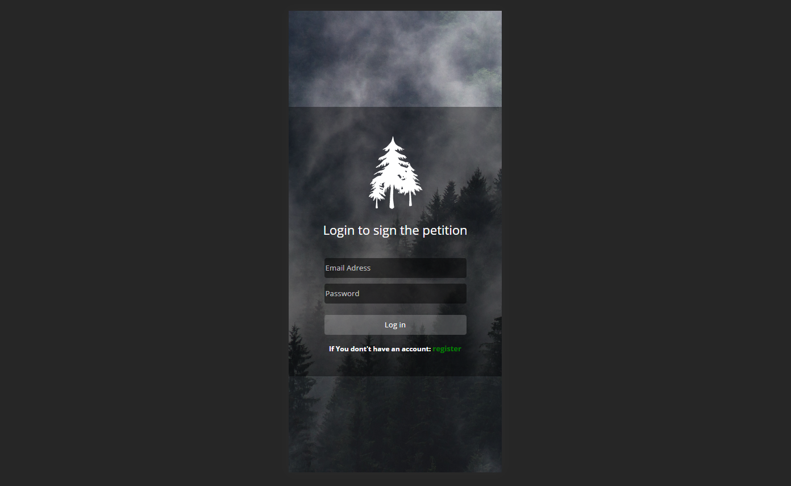

### Petition

Sign petition to save the trees!

http://finalpetition.herokuapp.com/register

---

### Frontend

To build a frontend I used pure HTML/CSS.

---

### Backend

Backend is build with Node.js, Express.js, and PostgreSQL. Data base is created to store user informations necessary for authentication.
Everything is protected from CSURF attacks and SQL injections.
For rendering different HTML templates is used Handlebars.js

---

### Features

To sing the petition you need to register creating your account.

If you already have an account you can log in.

You sing the petition using virtual sign in canvas which is stored in data base as a string.

There is possibility to see all signers.

If it will be necessary you can delete your signature or change your profile informations.

Page is fully responsive.

